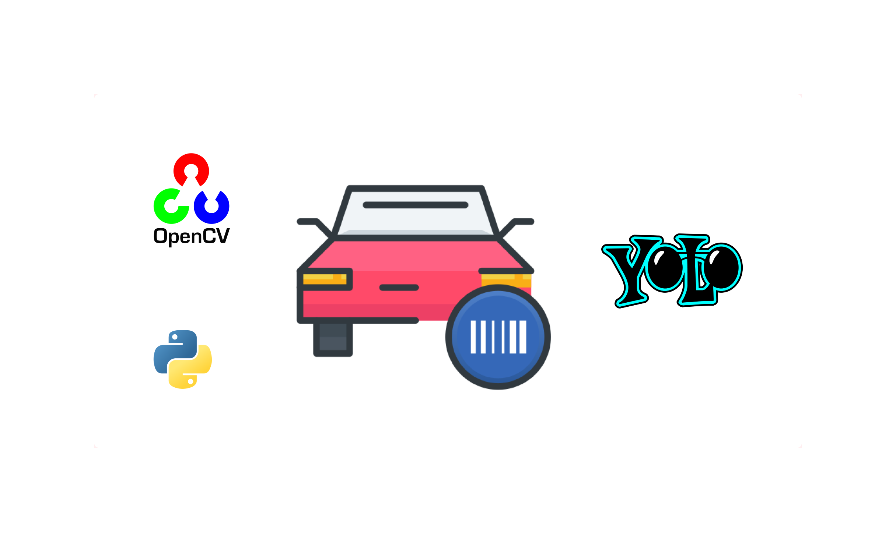

# Vehicle Registration Plate Recognition




## Introduction
VRPR is a Computer Vison Based Vehicle Registration Plate Recognition using YOLO v8 and Easy OCR. This project was developed as part of the Python Programming course at GD Goenka University. The main objective of this project is to find and extract registration numbers from vehicles.


## Installation
To install and run this project locally, follow these steps:

1. Clone the repository:
    ```sh
    git clone https://github.com/arbiter-gh/vrpr.git
    ```
2. Navigate to the project directory:
    ```sh
    cd vrpr
    ```
3. Install dependencies:
   ```sh
    pip install -r requirements.txt
    ```

## Usage
1. Importing dataset:
   ```sh
    py DataSet/importDataSet.py
   ```

2. Training the model:
   ```sh
    py Train/train.py
   ```
   
3. Detecting Registration Plate
   ```sh
   py Src/main.py
   ```

